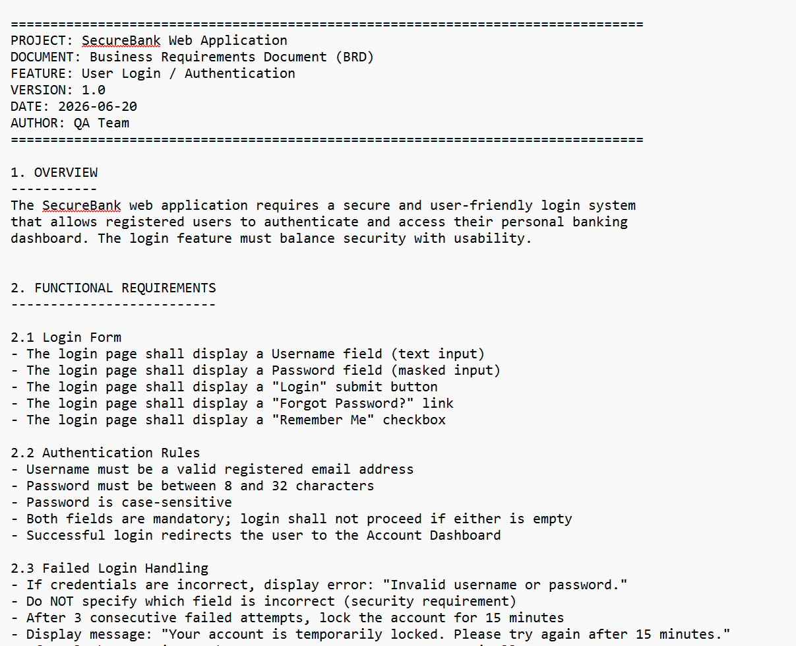
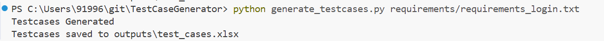
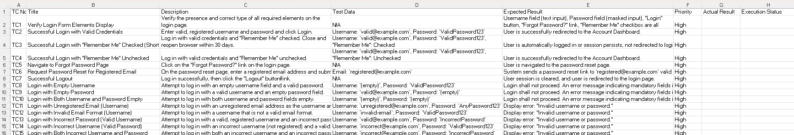

# 🤖 AI-Powered Test Case Generator
> Automatically generates structured test cases from any requirements document.
> using the Google Gemini AI API - saving QA engineers hours of manual work.

## The Problem
Writing test cases manually is one of the most time-consuming tasks 
in software testing. A single feature can take a QA engineer 3-5 hours 
to cover all positive, negative, boundary and edge cases.

## The Solution
This tool reads any requirements document and uses AI to automatically 
generate comprehensive, structured test cases in seconds - covering 
scenarios that manual testers often miss.

## How this tool Works
1. Drop your requirements file (BRD, User Story, plain text) into `/requirements`
2. Run the script - Script contains the prompt to be used by the AI agent.
3. AI agent reads the requirement, execute the prompt, and generate test cases according to the business requirement.
4. Get a fully formatted Excel test case sheet in `/outputs`

## Result
1. Generated 50+ test cases under 60 seconds
2. Generated an structured excel file with all the testcases with proper headers which is Ready to Use for a QA Engineer

## ⚡ Before vs After

| | Manual Testing | This Tool |
|---|---|---|
| Time to write test cases | 3-5 hours | Under 30 seconds |
| Test cases generated | 20-30 typically | 50+ comprehensive |
| Security cases covered | Often missed | Automatically included |
| Boundary cases covered | Often missed | Automatically included |

## How to Run it?
```bash
pip install -r requirements.txt
python generate_testcases.py requirements/requirements_login.txt
```

## Screenshots

### Input — Requirements Document


### Tool Running


### Output — Generated Test Cases


## Project Structure

TestCaseGenerator/
├── requirements/           (requirements to be considered by the AI agent)
├── outputs/                (output testcases in excel file)
├── screenshots/            (screenshots for README)
│   ├── requirement.png
│   ├── terminal_output.png
│   └── excel_output.png
├── .gitignore              (files that not need to be pushed to Github)
├── config.py               (loads the key safely)
├── generate_testcases.py   (main script - reads requirements and generates test cases)
├── requirements.txt        (Python packages to install)
└── README.md               (Details about this tool)

## Technologies
Python · Gemini API · OpenPyXL · python-dotenv · prompt engineering

## Future Improvements
- Support for User Story format input
- HTML report output option
- Multiple requirements files in one run
- Automatic test case deduplication

## Author
Mini Mariya Thomas
